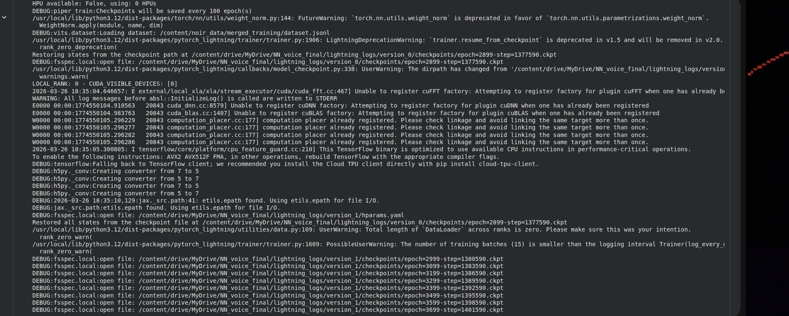
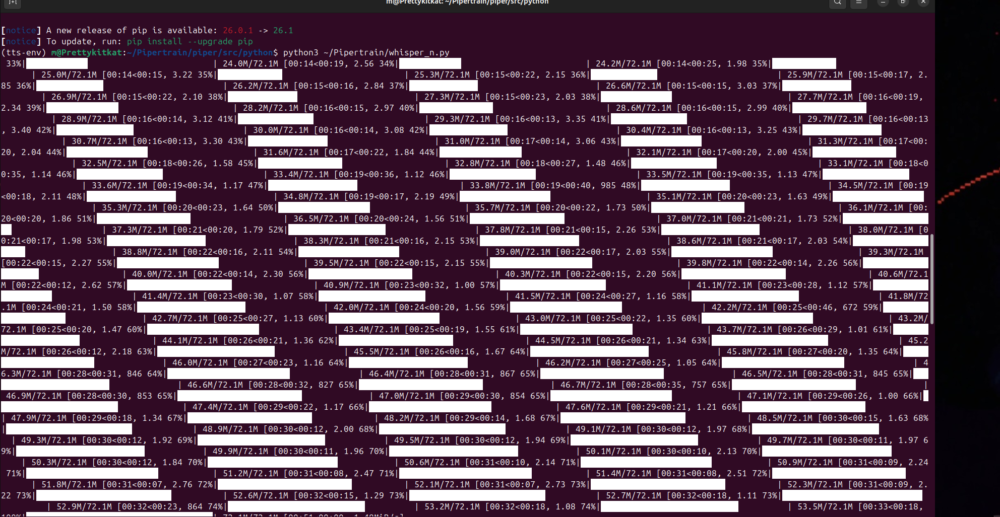
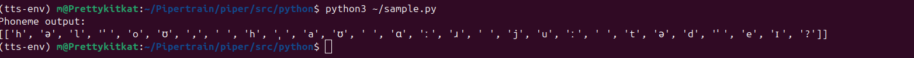

# Sovereign Voice Pipeline

**Training and deploying a custom Piper TTS voice on local hardware.**

A complete voice-synthesis pipeline from raw audio to locally-deployed ONNX model. Runs entirely offline. No cloud, no API costs, no data leaving the machine.

**Stack:** Piper (from source) · OpenAI Whisper · ONNX Runtime · Flask · ChromaDB · Ollama

**Full walkthrough:** [`voice_pipeline.ipynb`](./voice_pipeline.ipynb)



---

## What this pipeline does

- Cuts raw audio at breath points into training clips
- Auto-transcribes with OpenAI Whisper, then human-validates every line
- Fine-tunes a Piper TTS model on a lessac base checkpoint across 4,000 epochs
- Diagnoses and corrects an overfitting failure by reducing learning rate (2e-4 to 5e-5) and epoch count (3 to 1.5)
- Exports the final checkpoint to ONNX for local inference
- Integrates the voice into a Flask backend with ChromaDB retrieval and faster-whisper STT for real-time bidirectional speech

**Result:** a custom AI voice that runs entirely on local hardware.

---

## Pipeline

The pipeline splits across two environments: **local terminal** (Ubuntu 24.04) for prep and deployment, and **Google Colab** (T4 GPU) for training only. Training runs on Colab because a specific pip dependency has build issues in that environment, so training is isolated there and everything else stays local.

### Phase 1 - Local prep

1. Install Piper from source (Python 3.11 required)
2. Verify phonemization with a gate check before touching any audio
3. Cut raw audio into clips at 2.0s silence thresholds
4. Auto-transcribe with Whisper, then human-validate line by line
5. Package the validated dataset and upload to Google Drive

### Phase 2 - Colab training

1. Mount Drive, pull dataset, install Piper from source on Colab
2. Fine-tune from lessac base checkpoint, 4,000 epochs, fp32
3. Save checkpoints every 100 epochs directly to Drive (survival against Colab disconnects)
4. Compare checkpoints by ear across the training range to pick the best epoch

### Phase 3 - Back to local

1. Pull the chosen `.ckpt` from Drive
2. Patch the export script for newer PyTorch, then export to ONNX
3. Pair the `.onnx` with its matching `.onnx.json` config
4. Wire into the Flask pipeline for real-time voice I/O



---

## Architecture

```
┌─────────────────────────────────────────────────────────┐
│                  SOVEREIGN VOICE PIPELINE               │
│                                                         │
│   ┌──────────┐    ┌──────────┐    ┌───────────────┐     │
│   │ Mic /    │───▶│ faster-  │───▶│ Ollama        │     │
│   │ Audio In │    │ whisper  │    │ (Llama 3.2)   │     │
│   └──────────┘    │ STT      │    │               │     │
│                   └──────────┘    │  ┌───────────┐│     │
│                                   │  │ ChromaDB  ││     │
│                                   │  │ RAG       ││     │
│   ┌──────────┐    ┌──────────┐    │  │ retrieval ││     │
│   │ Speaker /│◀───│ Piper    │◀── │  └───────────┘│     │
│   │ Audio Out│    │ TTS      │    └───────────────┘     │
│   └──────────┘    │ (ONNX)   │                          │
│                   └──────────┘                          │
│                                                         │
│   Flask ◀──────────────────────────────────────────▶    │
│   (talk_piper.py)         All routes, one process       │
└─────────────────────────────────────────────────────────┘
```

Terminal and GUI share the same model, memory, and voice pipeline. One Flask process. No inter-service sync.

---

## Phoneme gate check

Piper converts text to IPA phonemes via `espeak-ng` before training. If phonemization is broken, everything downstream trains on garbage.

```python
from piper_phonemize import phonemize_espeak
test = phonemize_espeak("Hello, how are you today?", "en-us")
print(test)
```



The phoneme set at inference must match the phoneme set used during training. If you trained on `en-us` and inference with `en-gb`, output is garbled even though the model loads fine.

---

## Results

### Checkpoint comparison (empirical, by ear)

| Checkpoint    | Epoch     | Result                                                                 |
|---------------|-----------|------------------------------------------------------------------------|
| lessac base   | 2164      | Perfect English, no custom voice                                       |
| Early bake    | ~2899     | Lessac base with custom skin, English intact                           |
| Mid bake      | ~3099     | Drifting from both, becoming something new                             |
| Late bake     | ~3499     | Custom voice emerging, lessac undetectable                             |
| **Full bake** | 3999-5999 | **Full custom voice, high clarity and consistency**                    |

Sweet spot lands in the 4000-5999 range per training dataset. Beyond that, model degradation becomes audible.

### Demos

- ▶️ [Short exchange](https://youtu.be/46iRkHK_F34?si=hTnF9v2n_sVWO9_W) - dual-identity interaction, learning 3B Ollama model
- ▶️ [Long exchange](https://youtu.be/uyaW-_78wIc?si=wo4M1W6Rc_BdCOQ0) - extended conversation, same pipeline

Whisper STT → 3B Ollama model → Piper TTS. Two distinct trained voices. No internet required.

---

## Lessons learned

| Problem                                      | Cause                                                       | Fix                                                     |
|----------------------------------------------|-------------------------------------------------------------|---------------------------------------------------------|
| Bake 1 produced repetitive output            | Learning rate too high (2e-4), too many epochs (3)          | Reduced to lr=5e-5, 1.5 epochs                          |
| Lost a 20+ hour training run                 | Colab disconnected, checkpoints on local storage            | Always `--default_root_dir` to Google Drive             |
| ONNX export failed on Colab                  | Torch version mismatch between Colab and local              | Export locally in controlled venv                       |
| `piper-phonemize` import error               | Python 3.12 breaks the C extension                          | Pin to Python 3.11                                      |
| Training zip upload failed silently          | `lightning_logs/` inflated zip to 2+ GB                     | Exclude `lightning_logs/` from zips                     |
| Whisper transcription ~95% accurate          | Whisper guesses wrong on ~5% of clips                       | Human validation. Listened to every clip.               |
| Phoneme set mismatch at inference            | Trained on en-us, tested with en-gb                         | Check `voice.onnx.json` espeak voice field must match   |

---

## Why sovereign matters

- **No API costs.** Inference is free after training.
- **No rate limits.** Speak as much as you want.
- **No data exfiltration.** Conversations never leave the machine.
- **No vendor dependency.** The model can't be deprecated or revoked.
- **Persistent.** The voice is yours permanently.

---

*Built with patience, failure, and persistence.*

**Contact:** [GitHub](https://github.com/miagonellm) · [Portfolio](https://miagonellm.github.io/222datascience.github.io/)
